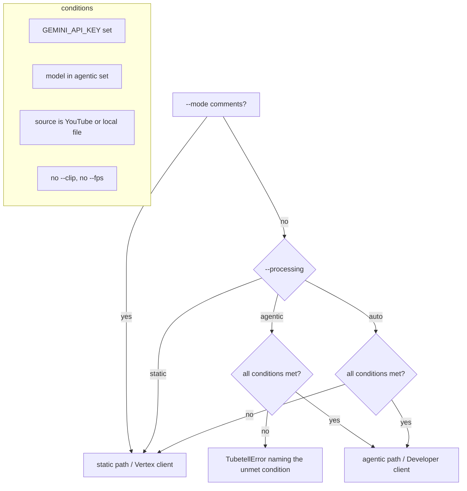

# Agentic Video Understanding - Plan

## Goal Capsule

- **Objective:** A tubetell run on a long video costs a small fraction of today's tokens and time, with no change to what the user types or reads back — same modes, same `--prompt`, same timestamped output, same usage line on stderr.
- **Means:** Route eligible requests through Gemini's Interactions API with `processing: "agentic"` on the Developer API, keeping the Vertex `generate_content` path as the fallback (KTD1, KTD2, KTD3).
- **Authority:** Requirements (R-IDs) win on behavior; KTDs win on mechanism; units carry only local deltas.
- **Stop conditions:** Stop and report if the Interactions API rejects YouTube URLs or uploaded files in agentic mode for the pinned models, or if the SDK bump breaks the existing Vertex path in a way that cannot be contained to one unit.
- **Execution profile:** Standard depth, five units, one PR. Land the units as separate commits in dependency order.
- **Tail ownership:** The implementer runs the manual smoke checks in the Verification Contract against a real YouTube URL and a real local file before declaring done; docs/example.md numbers come from that run.

---

## Product Contract

### Summary

Add a second request path to tubetell. When a Gemini Developer API key is present and the model supports agentic video understanding, tubetell calls `client.interactions.create` with the video marked `processing: "agentic"` — Gemini navigates the timeline itself and loads only what the prompt needs. A 57-minute podcast drops from 314,770 tokens / 56 s to about 20,000 tokens / 18 s for summary-plus-claims and produces a complete 00:00→57:30 transcript in about 19,000 tokens. Everything the user sees stays the same. The existing Vertex path with its frame-budget planner remains the fallback and the explicit `static` choice. The default model moves to `gemini-3.7-flash` for both paths.

### Problem Frame

Gemini tokenizes video at a fixed rate in static mode, so an hour of talking heads is about 1.05 M tokens — over the window. tubetell works around that with low-resolution frames and consecutive clips plus a merge pass (`src/tubetell/budget.py`), which costs money, time, and — for claims and summary — quality, since the model has to reason over a heap of irrelevant frames. Google shipped agentic video understanding on Gemini 3.7 Flash / 3.6 Flash / 3.5 Flash Lite: the model requests transcript and frames on demand and bills what it loads. A spike in this session confirmed a 94 % token reduction on the repo's own example video with equal or better answers. Two constraints shape the work: the Vertex Interactions endpoint returns `Unsupported model interaction` for every model in project `tvm-random`, and only google-genai ≥ 2.21.0 serializes the `processing` field.

### Key Decisions

- **Comments mode is untouched** — it reads the YouTube comment section, not the video; nothing in this change applies. (session-settled: user-approved — chosen over folding comments into the new client: no benefit, extra surface.) Governs R12.
- **Local files are in scope via the Files API** — an upload step makes agentic mode available for `.mov`/`.mp4` recordings, not only YouTube URLs. (session-settled: user-directed — chosen over a YouTube-only first release: the upload costs ~8 s for an 11 MB file and the API accepted it with agentic processing in the spike.) Governs R5, R6.
- **The default model becomes `gemini-3.7-flash` for every path**, including static/Vertex. (session-settled: user-directed — chosen over bumping only when agentic is chosen: one default is simpler to explain and document; the model exists on Vertex in `tvm-random`.) Governs R9.

### Requirements

**Processing selection**

- R1. A new `--processing {auto,agentic,static}` flag selects the request path; the default is `auto`.
- R2. In `auto`, tubetell picks `agentic` when all of these hold: `GEMINI_API_KEY` is set, the model is one of `gemini-3.7-flash`, `gemini-3.6-flash`, `gemini-3.5-flash-lite`, the source is a YouTube URL or a local file, and neither `--clip` nor `--fps` was given. Otherwise it picks `static`.
- R3. An explicit `--processing agentic` whose conditions in R2 are not met fails with a `TubetellError` that names the unmet condition (missing key, unsupported model, `gs://` source, or `--clip`/`--fps` given).
- R4. `--processing static` runs today's Vertex path unchanged, including `budget.py` planning, `--fps`, `--clip`, `--width`, and `--no-transcode`.

**Agentic request**

- R5. Agentic mode sends a YouTube URL as a video input with `processing: "agentic"`; a local file is first uploaded through the Gemini Files API, referenced by its file URI and MIME type, and deleted after the response (also on failure).
- R6. Agentic mode sends the original local file without the ffmpeg proxy; `--width` and `--no-transcode` do not apply.
- R7. Every agentic request carries the same mode prompt or `--prompt` text and the same timestamp rule as the static path, with the runtime bound when `source_duration` can establish it.
- R8. The answer is the concatenated text of the interaction's `model_output` steps; thought summaries and processing steps are never printed as output.
- R9. The default `--model` is `gemini-3.7-flash`.

**Feedback and errors**

- R10. The stderr usage line in agentic mode reports input, thought, tool-use, output, and total tokens; the static format is unchanged.
- R11. When the interaction's `status` is `incomplete`, tubetell warns on stderr that the answer was truncated at the output cap, mirroring the static path's warning.
- R12. `--mode comments` behaves exactly as today regardless of `--processing`.
- R13. Developer-API failures (bad key, 4xx, 5xx after the SDK's retries, quota) surface as a `TubetellError` with the API's message, not a traceback.
- R14. When neither `GEMINI_API_KEY` nor `GOOGLE_CLOUD_PROJECT` is set, the error names both variables and the `.env` locations that were read.

**Configuration and docs**

- R15. `GEMINI_API_KEY` is read through the existing `.env` discovery (`config.load_env`), documented in `.env.example`, and cleared by the tests' clean-env fixture.
- R16. README, `docs/example.md`, and the `cli.py` module docstring describe both paths, the selection rules, the new key, and the new default model; version bumps to 0.4.0.

### Scope Boundaries

- Static mode via the Interactions API (the `{"type":"static","start_offset":…}` object) is out: google-genai 2.21.0 serializes it as a Python repr and the API rejects it; static stays on Vertex `generate_content`.
- `gs://` sources always take the static path; the Developer API cannot read Cloud Storage.
- No streaming, no `previous_interaction_id` multi-turn, no `background` execution.
- No change to thinking level or thought summaries; API defaults apply.

### Deferred to Follow-Up Work

- Retry-once heuristic for the known first-fetch truncation on uncached YouTube videos (googleapis/python-genai issue #1898) — needs a "suspiciously short for this runtime" threshold that is better tuned after real use.
- README claims transcript/claims chunks are concatenated in static mode; the code merges every mode (`LIST_MODES` is imported but unused in `cli.py`). Fix as its own docs/fix commit.
- Agentic clipping via prompt text ("only consider 12:00–18:00") once the SDK serializes the static object correctly, or a `--clip` translation for agentic mode.

### Acceptance Examples

- AE1. **Covers R2, R5, R10.** Given `GEMINI_API_KEY` set and default model, when the user runs `tubetell https://youtu.be/vOVKnYoH1p4 --mode claims`, then the request goes through `interactions.create` with `processing: "agentic"`, the answer is printed, and stderr shows a usage line with a tool-use token count.
- AE2. **Covers R2, R4.** Given `GEMINI_API_KEY` set, when the user runs the same command with `--clip 10:00-20:00`, then the Vertex path runs with `start_offset`/`end_offset` metadata and no Interactions call is made.
- AE3. **Covers R2, R14.** Given no `GEMINI_API_KEY` and no `GOOGLE_CLOUD_PROJECT`, when the user runs any video mode, then the process exits with a message naming both variables and the `.env` files read.
- AE4. **Covers R3.** Given `--processing agentic` and a `gs://bucket/clip.mp4` source, then tubetell exits with an error saying agentic mode does not support Cloud Storage sources.
- AE5. **Covers R5, R6.** Given a local `.mov` and `GEMINI_API_KEY`, when the user runs `tubetell clip.mov`, then the file is uploaded once, polled to `ACTIVE`, used in one interaction, and deleted — and deleted even if the interaction raises.
- AE6. **Covers R12.** Given `--mode comments --processing agentic`, then comments are fetched via the YouTube API and analyzed on the Vertex client as today; no Interactions call is made.

### Sources

- Spike outputs (this session): summary+claims 20,331 tokens / 18 s, full transcript 18,940 tokens / 49 s, Files API upload 11 MB / 7 s clip in 8 s + 10 s interaction, 956 tokens.
- Gemini docs: Video understanding — Interactions API (`ai.google.dev/gemini-api/docs/video-understanding`, agentic section); Interactions API reference (`ai.google.dev/api/interactions-api`); Files API (`ai.google.dev/api/files`).
- google-genai CHANGELOG v2.21.0 (2026-08-31), PR #2908 "add Video Understanding support to the Interactions API", PR #2920 (`ProcessingCallStep`/`ProcessingResultStep`).
- Vertex probe: `client.interactions.create` on `tvm-random` (`global`, `us-central1`) → `Unsupported model interaction` for 2.5-flash, 3.5-flash-lite, 3.6-flash, 3.7-flash, 3.1-pro-preview, including text-only input.

---

## Planning Contract

### Key Technical Decisions

- KTD1. **Agentic requests use a Developer-API client (`genai.Client()` with `GEMINI_API_KEY`); the Vertex client stays for static and comments.** (session-settled: user-approved — chosen over waiting for Vertex support: Vertex rejects Interactions for every model in the project today.) Two `make_client` variants, each constructed lazily by the path that needs it, so a static run never requires the key and an agentic run never requires the project.
- KTD2. **Call the Interactions API through google-genai ≥ 2.21.0 (`client.interactions.create`), not raw REST.** (session-settled: user-directed — chosen over `requests.post` to `/v1beta/interactions`: 2.21.0 serializes `processing: "agentic"` correctly, verified live; the SDK brings typed steps/usage, auth headers, and its own 2-retry backoff.) Pin `google-genai>=2.21.0` in `pyproject.toml`. The SDK's static-object serialization bug is irrelevant because static stays on `generate_content`.
- KTD3. **`--processing auto|agentic|static` with `auto` default; resolution lives in one pure function** (`resolve_processing(explicit, has_key, model, source_kind, clip, fps) -> "agentic" | "static"` plus the reason when it refuses). (session-settled: user-approved — chosen over a boolean `--agentic` switch: three states let `auto` exist without hiding the fallback.) `--clip` and `--fps` are static-only concepts, so in `auto` they select static rather than erroring; only an explicit `agentic` errors (R2, R3).
- KTD4. **New module `src/tubetell/agentic.py` owns everything Interactions-specific**: input construction, the create call, text extraction, usage formatting, truncation detection, and Files API lifecycle. `cli.analyze` grows one branch; `gemini.py` and `budget.py` are not modified beyond what R9 needs. Mirrors how `youtube.py` isolates the YouTube Data API.
- KTD5. **Prompt text is shared, not duplicated.** The agentic branch reuses `MODE_PROMPTS`, `video_body`, and `timestamp_rule` from `gemini.py` as plain strings; the runtime bound comes from the existing `source_duration` (ffprobe / `videos.list`), best effort as today (R7).
- KTD6. **Usage and truncation map onto the Interactions shape.** `usage.total_input_tokens`, `total_thought_tokens`, `total_tool_use_tokens`, `total_output_tokens`, `total_tokens` render as `in + thinking + tool + out = total`; `status == "incomplete"` is the truncation signal (there is no `finish_reason`). Send `generation_config.max_output_tokens = 65535` for parity with `request_config`.
- KTD7. **Local files upload as-is via `client.files.upload`, poll `files.get` until `ACTIVE`, delete in a `finally`.** No ffmpeg proxy: `INLINE_LIMIT` (12 MiB) is a Vertex inline-bytes constraint; the Files API takes the original. MIME type from the file extension through the existing media-type table. Files expire after 48 h server-side anyway, so a failed delete is a stderr warning, not an error.
- KTD8. **Errors are wrapped inside `agentic.py`.** Any exception from `interactions.create`, `files.upload`, or `files.get` becomes a `TubetellError` carrying the API message (the SDK raises `_gaos` error classes that may not subclass `genai_errors.APIError`, which is what `main()` catches). Rely on the SDK's built-in retries; do not port `generate()`'s 4/8/16 s loop.
- KTD9. **The `GOOGLE_CLOUD_PROJECT` gate in `main()` moves into the static path.** Today `main()` exits before `analyze()` if the project is unset; `make_client()` already raises a clear `TubetellError`, so the early gate becomes: "neither key nor project set → combined message" (R14), else defer to whichever path runs.

### High-Level Technical Design

Processing resolution — every decision point, in order (R2, R3):



Agentic request lifecycle (R5–R8, R10, R11):

```mermaid
sequenceDiagram
  participant CLI as cli.analyze
  participant AG as agentic.py
  participant FILES as Files API
  participant IX as Interactions API
  CLI->>AG: run(source, request, runtime, model)
  alt local file
    AG->>FILES: upload(original file)
    loop until ACTIVE
      AG->>FILES: get(name)
    end
  end
  AG->>IX: interactions.create(model, [video{uri, processing: agentic}, text{prompt + timestamp rule}], max_output_tokens)
  IX-->>AG: steps[processing_call, processing_result, thought*, model_output*], usage, status
  AG->>AG: join model_output text; format usage; warn if status == incomplete
  opt local file
    AG->>FILES: delete(name) — in finally
  end
  AG-->>CLI: answer text
```

### Assumptions

- Agentic processing on an uploaded file works for the three pinned models; verified on `gemini-3.7-flash` only.
- `client.interactions.create` in 2.21.0 is stable enough to pin; the SDK's Interactions surface (`_gaos`) is generated code and field names could shift in a minor release. The pin is `>=2.21.0`; the implementer records the exact tested version in `uv.lock`.
- `source_duration` for a local file (ffprobe) keeps working unchanged; the runtime bound is optional as before.

### Risks & Dependencies

- **First-fetch truncation on uncached YouTube videos** (python-genai issue #1898, open): a transcript can come back covering a fraction of the video the first time. Mitigation is deferred (see Scope Boundaries); the plan surfaces it in README troubleshooting.
- **Thought tokens dominate cost** in agentic mode (≈98 % of the 20 k tokens in the spike) and bill at the output rate. Net cost is still far below static for long videos, but README should say "≈ −66 % cost, −90 % tokens", not equate the two.
- **Two credentials, two failure surfaces.** A user with only `GEMINI_API_KEY` gets agentic for YouTube and local files but a `TubetellError` for `gs://`; a user with only Vertex credentials gets today's behavior. R14 covers the neither case.
- **Default model change** affects static users: `gemini-3.7-flash` on Vertex has different pricing than the README's 2.5-flash table; the docs unit updates or removes that table.

---

## Implementation Units

### U1. Processing selection, key loading, and CLI flag

- **Goal:** tubetell knows which path to take before touching any client.
- **Requirements:** R1, R2, R3, R9, R14, R15; KTD3, KTD9.
- **Dependencies:** none.
- **Files:** `src/tubetell/config.py`, `src/tubetell/cli.py`, `.env.example`, `tests/test_config.py`, `tests/test_cli.py`, `tests/test_env_discovery.py`.
- **Approach:**
  1. Add `load_gemini_api_key()` in `config.py` following `youtube.load_api_key()` — returns the key or `None`; a separate `missing_credentials_message(loaded)` reuses `missing_project_message`'s list of files read for the R14 case.
  2. Add `resolve_processing(...)` as a pure function (KTD3) returning the chosen mode or raising `TubetellError` with the unmet condition when `agentic` was explicit. Source kind comes from the same classification `source_part` already does (YouTube / gs / local).
  3. Add `--processing` to argparse with choices `auto|agentic|static`, default `auto`; bump `--model` default to `gemini-3.7-flash`; update the module docstring's Vertex-only sentence since it is the `--help` text.
  4. Replace the hard `GOOGLE_CLOUD_PROJECT` exit in `main()` with the combined neither-key-nor-project check; leave per-path errors to `make_client` / the agentic client factory.
  5. Add `GEMINI_API_KEY` to `.env.example` and to `ENV_KEYS` in `tests/test_env_discovery.py`; give the `analyze()` tests in `test_cli.py` an explicit `processing="static"` or a cleared `GEMINI_API_KEY` so a developer's real key cannot flip them.
- **Patterns to follow:** `youtube.load_api_key`, `config.missing_project_message`, argparse block in `cli.main`.
- **Test scenarios:**
  - `resolve_processing("auto", has_key=True, model="gemini-3.7-flash", source_kind="youtube", clip=None, fps=None)` → `agentic`.
  - Same with `model="gemini-2.5-flash"` → `static`; with `source_kind="gs"` → `static`; with `clip=(0, 60)` → `static`; with `fps=1.0` → `static`; with `has_key=False` → `static`.
  - `resolve_processing("agentic", has_key=False, ...)` raises `TubetellError` mentioning `GEMINI_API_KEY`; with `source_kind="gs"` mentions Cloud Storage; with `clip` set mentions `--clip`; with an unsupported model names the model.
  - `resolve_processing("static", has_key=True, model="gemini-3.7-flash", ...)` → `static`.
  - `main()` with neither `GEMINI_API_KEY` nor `GOOGLE_CLOUD_PROJECT` exits with a message naming both variables (Covers AE3).
  - `main()` with only `GEMINI_API_KEY` set does not exit at the credentials gate (analyze is reached; patch `cli.analyze`).
  - `--help` output lists `--processing` with the three choices and shows `gemini-3.7-flash` as the model default.
  - Clean-env fixture clears `GEMINI_API_KEY` (assert it is absent inside a test).
- **Verification:** Existing `test_cli.py` tests stay green with a real `GEMINI_API_KEY` exported in the developer's shell; the new selection tests pass; `tubetell --help` shows the flag.

### U2. `agentic.py` — Interactions request, answer extraction, usage, truncation, errors

- **Goal:** One function turns (source, prompt, runtime, model) into answer text via the Interactions API for a YouTube URL.
- **Requirements:** R5 (YouTube half), R7, R8, R10, R11, R13; KTD1, KTD2, KTD4, KTD5, KTD6, KTD8.
- **Dependencies:** U1 (key loader), SDK bump (done in this unit: `pyproject.toml`, `uv.lock`).
- **Files:** `src/tubetell/agentic.py` (new), `pyproject.toml`, `uv.lock`, `tests/test_agentic.py` (new).
- **Approach:**
  1. Bump `google-genai>=2.21.0`; run the full suite to confirm the Vertex path is unaffected by the SDK jump.
  2. `make_developer_client()` — `genai.Client()` picking up `GEMINI_API_KEY`; raise `TubetellError` when the key is missing (KTD1).
  3. `video_input(source)` — for YouTube: `{"type": "video", "uri": <watch URL>, "processing": "agentic"}` (no `mime_type` needed for YouTube; harmless if set). Reuse `youtube.video_id`/URL normalization already used by `source_part`.
  4. `run(client, *, model, video, text)` — `interactions.create(model=..., input=[video, {"type": "text", "text": text}], generation_config={"max_output_tokens": 65535})`; join `content[].text` across every `model_output` step (KTD6); print the usage line and the `incomplete` warning to stderr; wrap any exception as `TubetellError` with the API message (KTD8).
  5. `format_usage_interaction(usage)` — `in + thinking + tool + out = total` with the `total_*` fields; tolerate missing fields (`None` → 0) the way `gemini.format_usage` does.
  6. Text for the request is `video_body(request, runtime)` from `gemini.py` (KTD5) — the caller passes it in; this module does not import prompt presets.
- **Execution note:** Start with a fake client (`SimpleNamespace(interactions=SimpleNamespace(create=...))`) returning a recorded response shaped like the spike's `rest_agentic.json`, so extraction, usage, and truncation are tested before any network call.
- **Patterns to follow:** `gemini.generate` (stderr usage/truncation lines), `gemini.format_usage` (None-tolerant), `youtube._get` (wrap transport errors into `TubetellError`), `test_prompts.py` fake-client style.
- **Test scenarios:**
  - Fake `create` returns steps `[processing_call, processing_result, thought, model_output]` → return value equals the `model_output` text; the `thought` text is not included.
  - Two `model_output` steps → texts are concatenated in order.
  - `usage` with `total_input_tokens=49, total_thought_tokens=20045, total_tool_use_tokens=95, total_output_tokens=164, total_tokens=20353` → stderr line reads `49 in + 20,045 thinking + 95 tool + 164 out = 20,353 total` (match `gemini.format_usage` formatting).
  - `usage` missing `total_tool_use_tokens` → line still renders with 0.
  - `status == "incomplete"` → stderr contains a truncation warning; `status == "completed"` → no warning.
  - The request sent to the fake `create` contains `processing == "agentic"`, the YouTube watch URL, the exact text passed in, and `max_output_tokens == 65535`.
  - Fake `create` raises an SDK error with message `Unsupported model interaction: x` → `TubetellError` whose message contains that text; no traceback escapes.
  - `make_developer_client()` without `GEMINI_API_KEY` raises `TubetellError` naming the variable.
- **Verification:** `tests/test_agentic.py` passes without network; `uv run pytest -q` stays green after the SDK bump; a manual run against `vOVKnYoH1p4 --mode summary` prints an answer and a usage line with a tool-use count.

### U3. Files API lifecycle for local files

- **Goal:** A local video or audio file runs agentically via upload → poll → interact → delete.
- **Requirements:** R5 (local half), R6; KTD7.
- **Dependencies:** U2.
- **Files:** `src/tubetell/agentic.py`, `src/tubetell/media.py` (MIME lookup reuse only), `tests/test_agentic.py`.
- **Approach:**
  1. `uploaded_file(client, path)` context manager: `client.files.upload(file=path)`, poll `client.files.get(name=...)` with a short sleep while `state.name == "PROCESSING"`, yield `(uri, mime_type)`, `finally: client.files.delete(name=...)`; a failed delete logs a stderr warning (KTD7).
  2. Reject `state.name == "FAILED"` with a `TubetellError` that names the file.
  3. `video_input` gains the local-file branch: `{"type": "video", "uri": file.uri, "mime_type": file.mime_type, "processing": "agentic"}`.
  4. Progress lines to stderr (`uploading clip.mov (11 MB)...`, `processing...`) in the style of `media.prepare_local`'s `_log`.
  5. Runtime bound still comes from `source_duration` (ffprobe) in the caller; no ffmpeg transcode runs on this path (R6).
- **Patterns to follow:** `media.prepare_local` logging, `media.MIME_BY_SUFFIX` via `media.mime_type(path)` for the MIME type when the SDK does not infer one.
- **Test scenarios:**
  - Fake `files.upload` returns `state=PROCESSING`, then `files.get` returns `ACTIVE` → interaction is created with the file's `uri` and `mime_type`, and `files.delete` is called once with the file name (Covers AE5).
  - Interaction raises → `files.delete` is still called, and the original `TubetellError` propagates (Covers AE5).
  - `files.get` returns `FAILED` → `TubetellError` naming the file; no interaction call.
  - `files.delete` raises → warning on stderr, answer still returned.
  - Poll loop sleeps between `PROCESSING` states (patch `time.sleep`, assert it was called) and stops on `ACTIVE`.
  - `--width`/`--no-transcode` given with a local file in agentic mode → no transcode invoked (assert `prepare_local` is not called).
- **Verification:** Manual run on an `.mp4` under 100 MB completes and the file no longer appears in `client.files.list()` afterwards.

### U4. Wire the branch into `cli.analyze`

- **Goal:** `analyze()` dispatches to the agentic module or the existing static flow according to U1's resolution, with lazy clients.
- **Requirements:** R2, R4, R7, R12; KTD1, KTD3, KTD4, KTD5, KTD9.
- **Dependencies:** U1, U2, U3.
- **Files:** `src/tubetell/cli.py`, `tests/test_cli.py`.
- **Approach:**
  1. `analyze()` takes `processing="auto"`; the comments branch runs first and unchanged, constructing the Vertex client only there and in the static branch (KTD1).
  2. After `request = prompt or MODE_PROMPTS[mode]` and `source_duration`, call `resolve_processing`; on `agentic`, build `video_body(request, runtime)` and call `agentic.run(...)` with the source; on `static`, continue into the existing `budget.plan` / `ask` / merge code untouched.
  3. Import the agentic entry points by name into `cli` so tests patch `cli.<name>` as they do for `generate`, `source_part`, `source_duration`.
  4. `main()` passes `args.processing` through; `--out` handling is unchanged because both paths return a string.
- **Patterns to follow:** existing `analyze()` structure and the monkeypatch targets in `tests/test_cli.py`.
- **Test scenarios:**
  - `analyze(url, mode="claims", processing="auto")` with `GEMINI_API_KEY` set and default model → the patched agentic runner is called with text containing the claims prompt and the timestamp rule; `cli.generate` is not called; `cli.make_client` is not called (Covers AE1).
  - Same with `clip="10:00-20:00"` → static path: `cli.generate` called, agentic runner not called (Covers AE2).
  - `processing="static"` with key set → static path.
  - `mode="comments", processing="agentic"` → `fetch_comments` and `generate` called on the Vertex client; agentic runner not called (Covers AE6).
  - `processing="agentic"` with a `gs://` source → `TubetellError` mentioning Cloud Storage; neither client constructed (Covers AE4).
  - Existing `analyze` tests (clip skips duration, low_res at 61 min, chunk+merge at 6 h) still pass with `processing="static"` or no key in env.
  - `source_duration` returning `None` in agentic mode → text carries the timestamp rule without an upper bound (same as static today).
- **Verification:** Full suite green; the manual smoke matrix in the Verification Contract passes.

### U5. Documentation, example, and release metadata

- **Goal:** A reader of README or `--help` can predict which path runs and what it costs.
- **Requirements:** R16; Risks section.
- **Dependencies:** U4.
- **Files:** `README.md`, `docs/example.md`, `.env.example`, `src/tubetell/cli.py` (docstring only, if not finished in U1), `pyproject.toml` and `src/tubetell/__init__.py` (version 0.4.0).
- **Approach:**
  1. README intro: Gemini reads the video via the Interactions API (agentic) or Vertex (static); new "Processing modes" section with the R2 rules as a short table; "Long videos" section gains a first paragraph saying agentic mode makes the budget planner unnecessary and the rest applies to static.
  2. Setup/Auth: add `GEMINI_API_KEY` (Google AI Studio) alongside the Vertex project; state which features need which credential (`gs://` → Vertex only).
  3. Replace `gemini-2.5-flash` mentions with `gemini-3.7-flash`; update or drop the Vertex 2.5-flash price table; add a cost note: thought tokens bill at output rate, expect ≈ −66 % cost / ≈ −90 % tokens on hour-long videos.
  4. `docs/example.md`: add one agentic run of the same video per mode with real token lines from the smoke run; keep the static numbers for comparison.
  5. Troubleshooting: the uncached-YouTube truncation issue (#1898) with "run again" advice; `Unsupported model interaction` means the Vertex client was used for agentic — check `--processing`/key.
  6. Bump version to 0.4.0 in both `pyproject.toml` and `__version__` in `src/tubetell/__init__.py` (what `tubetell --version` prints).
- **Test expectation:** none — documentation and metadata; verify by reading the rendered README and running `tubetell --version` if present.
- **Verification:** Every command in README runs as written; `docs/example.md` numbers come from an actual run.

---

## Verification Contract

| Check | Command / action | Applies to | Pass signal |
|---|---|---|---|
| Unit tests | `uv run pytest -q` | U1–U4 | all green, including the pre-existing 118 |
| SDK bump regression | `uv run pytest -q` immediately after changing the pin, before other edits | U2 | no failures in `test_prompts.py` / `test_cli.py` |
| Agentic YouTube smoke | `tubetell https://www.youtube.com/watch?v=vOVKnYoH1p4 --mode claims` with `GEMINI_API_KEY` | U2, U4 | answer with timestamps ≤ 57:32; usage line shows tool tokens; total < 50 k |
| Agentic transcript smoke | same URL, `--mode transcript --out t.md` | U2 | transcript runs 00:00 → ~57:30; no truncation warning |
| Local file smoke | `tubetell <11 MB .mp4>` | U3 | upload/processing lines on stderr; answer; file absent from `client.files.list()` |
| Static fallback smoke | same URL with `--processing static` and with `--clip 10:00-12:00` | U4 | Vertex usage line format (`in + thinking + out`), no upload/agentic lines |
| Credential gates | run with neither variable; with only `GEMINI_API_KEY` and a `gs://` source | U1, U4 | R14 message; R3 message |
| Docs | read README top to bottom; run each command block | U5 | no stale `gemini-2.5-flash`, no Vertex-only claims |

---

## Definition of Done

- All requirements R1–R16 are implemented and each acceptance example AE1–AE6 has a passing test or a recorded smoke result.
- `uv run pytest -q` is green; no test depends on a real `GEMINI_API_KEY` being present or absent in the developer's shell.
- `pyproject.toml` pins `google-genai>=2.21.0`, version is 0.4.0 in both `pyproject.toml` and `src/tubetell/__init__.py`, and `uv.lock` is updated.
- README, `docs/example.md`, `.env.example`, and the `--help` text describe both paths and the selection rules; `docs/example.md` agentic numbers come from a real run.
- No spike code, debug prints, or dead branches remain (the `LIST_MODES` import stays untouched — it is a deferred item, not this change's debt).
- Per unit: U1 — selection tests and credential gate tests pass; U2 — `test_agentic.py` passes offline and the YouTube smoke succeeds; U3 — local-file smoke leaves no file behind; U4 — the smoke matrix passes; U5 — every README command runs as written.
